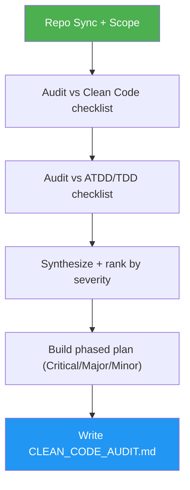

<!--
  DO NOT READ THIS FILE — This README.md is for human catalog browsing only.
  It ships inside the .skill package but is NEVER auto-loaded into agent context.
  The runtime loader only reads SKILL.md + references/ + scripts/ + agents/ when the skill triggers.
  If you're an AI agent, read the SKILL.md file instead for skill instructions.
-->

# Clean Code

> Audit a codebase against the bbv Clean Code Cheat Sheet and get a findings report plus a priority-phased implementation plan.

## Highlights

- **Faithful to the source** — encodes the full **bbv Clean Code Cheat Sheet V2.2** (Urs Enzler): Clean Code principles *and* Clean ATDD/TDD practices.
- **Two checklists, one audit** — design quality (SOLID, smells, naming, methods, conditionals, exceptions) + test craft (test smells, design-for-testability, test pyramid, CI).
- **Actionable output** — writes `CLEAN_CODE_AUDIT.md` with findings by category and a phased plan where every task has a file:line, effort estimate, dependencies, and acceptance check.
- **Priority-phased plan** — Phase 1 Critical → Phase 2 Major → Phase 3 Minor, so you fix what matters first.
- **Plan-only, no surprises** — never edits your source code. It audits and plans; you (or another skill) execute.
- **User-invoked only** — it won't fire on ordinary coding or PR-review tasks; you run it deliberately.

## When to Use

| Say this...                  | Skill will...                               |
| ---------------------------- | ------------------------------------------- |
| "/clean-code"                | Audit the scope and write the phased plan   |
| "Clean code audit of src/"   | Scan `src/` against the cheat sheet         |
| "How clean is this code?"    | Report findings by principle with file:line |
| "Give me a clean-code plan"  | Produce the Phase 1/2/3 remediation plan    |

Not for: general bug-fixing, feature work, performance tuning, or ordinary PR review — use `code-review`, `code-optimizer`, or `test-coverage` for those.

## How It Works

## Output

A single `CLEAN_CODE_AUDIT.md` at the repo root:

- **Summary** table (Critical / Major / Minor / Info counts)
- **Findings** grouped by category, each with `file:line` and the named principle/smell
- **Implementation Plan** in three priority phases, each task with ID, target, effort, dependencies, and acceptance check

## Source

bbv Software Services — *Clean Code Cheat Sheet* V2.2 by Urs Enzler (June 2013), based on Robert C. Martin's *Clean Code*. Licensed CC BY 3.0.
